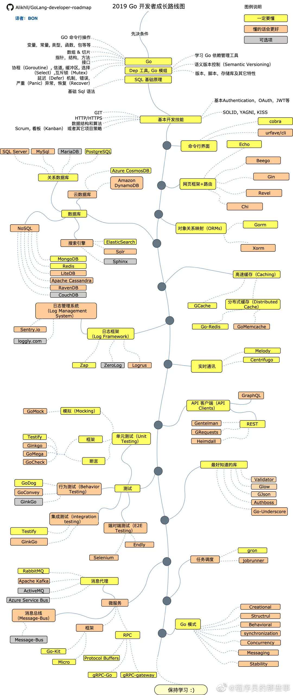

# Golang

优点
缺点
适用场景

Golang| C/C++| Java| Python
-|-|-|-

# 数据

## slice

## interface 与 reflect
reflect 性能

# 并发

## 携程

## channel

### 底层实现

# 性能与调试

## pprof
热点图

[Go 语言的高级调试方法](https://mp.weixin.qq.com/s/Abyeuzu5Su6MA_efThItbA)
[视频](https://www.bilibili.com/video/av87482478)

## go marshal
## test

# 工程

## 代码依赖
vendor gradlew

# 代码规范

## 参考
1. [github CodeReview](https://github.com/golang/go/wiki/CodeReviewComments)